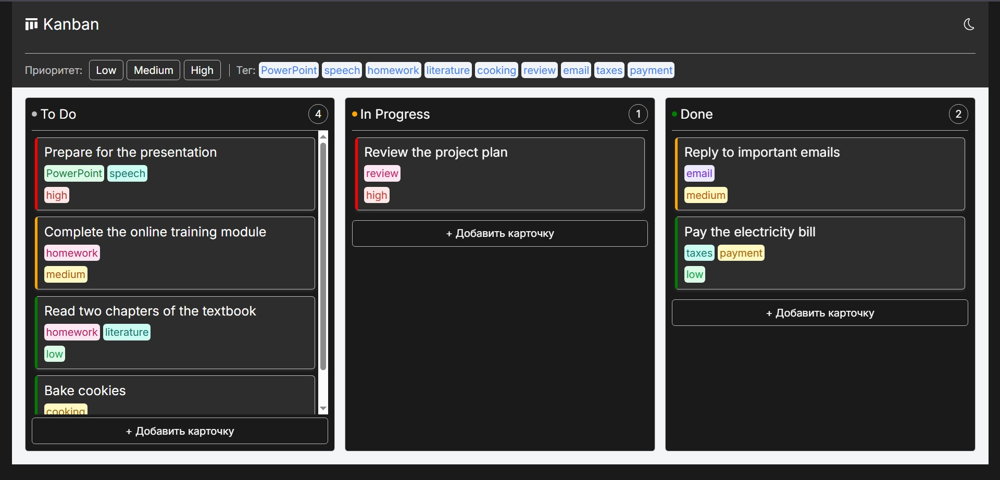
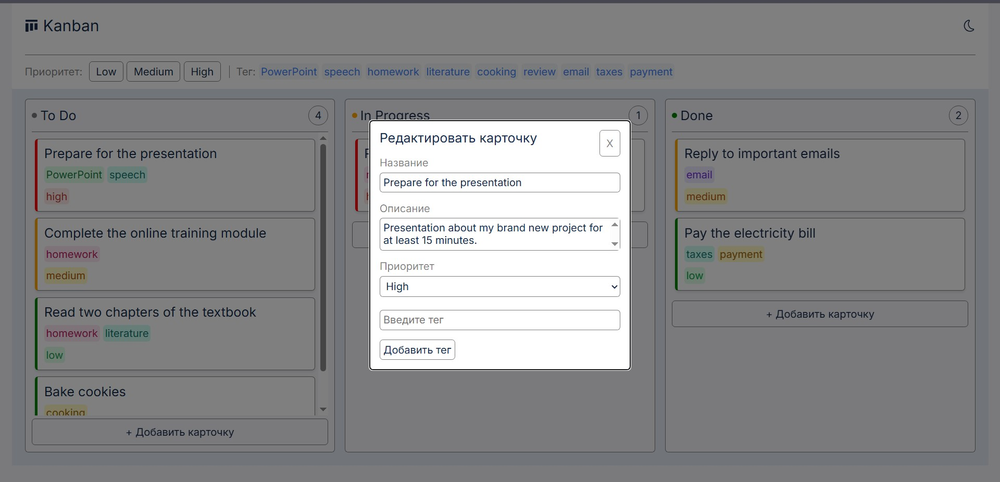

# Kanban Board

Kanban-доска для управления задачами — реализована на чистом JavaScript без фреймворков и сторонних библиотек.




---

## Технологии

- **HTML5** — семантическая разметка, нативный элемент `<dialog>` для модального окна
- **CSS3** — кастомные свойства (CSS-переменные), flexbox, анимации через `@keyframes`, адаптивная вёрстка
- **JavaScript ES6+** — без фреймворков, без jQuery, без сборщиков

---

## Архитектура

Проект намеренно разбит на модули — каждый файл отвечает за одну область:

```
kanban/
├── index.html
├── css/
│   ├── reset.css
│   └── style.css
└── js/
    ├── state.js      # данные, localStorage, все мутации state
    ├── render.js     # построение DOM из state
    ├── events.js     # обработчики пользовательских событий
    ├── dragdrop.js   # логика drag & drop
    └── app.js        # точка входа, инициализация
```

`state.js` не содержит ни одного обращения к DOM — данные полностью отделены от представления. `render()` вызывается после каждого изменения state и строит DOM заново из актуальных данных.

---

## Функциональность

**Управление карточками**

- Создание карточки через инлайн-форму в колонке
- Редактирование названия, описания, приоритета и тегов через модальное окно
- Live update — изменения в модалке применяются мгновенно без кнопки «Сохранить»
- Удаление карточки

**Drag & Drop**

- Перетаскивание карточек между колонками и внутри колонки
- Точное определение позиции вставки через `getBoundingClientRect()`
- Реализовано на нативном HTML5 Drag and Drop API

**Фильтрация**

- Фильтр по приоритету (Low / Medium / High) — повторный клик сбрасывает фильтр
- Фильтр по тегу — все уникальные теги собираются из карточек и отображаются в хедере
- Одновременная фильтрация по приоритету и тегу

**Сохранение данных**

- Весь state сохраняется в `localStorage` после каждого изменения
- При перезагрузке страницы данные восстанавливаются полностью

**Темы**

- Переключение тёмной и светлой темы через кнопку в хедере
- Тема сохраняется между сессиями
- Плавный переход через CSS `transition` на всех цветовых свойствах

**UX-детали**

- Цветная полоска слева на карточке в зависимости от приоритета
- Цвет каждого тега генерируется детерминированно через хэш-функцию — один и тот же тег всегда одного цвета
- Кнопка удаления появляется при наведении на карточку
- Анимация появления новой карточки (`fade-in` + `slide-down`)
- Анимация открытия модального окна
- Счётчик карточек в заголовке каждой колонки (с учётом активных фильтров)
- Фиксированный хедер — контент скроллится, панель фильтров остаётся на месте
- Адаптивная вёрстка — на ширине до 1000px колонки стекаются вертикально

**Доступность**

- Вся навигация доступна с клавиатуры через Tab
- `aria-label` на кнопках без текста
- Фокус возвращается на карточку после закрытия модального окна
- Поддержка закрытия форм и модалки по клавише Escape

---

## Запуск

Открыть `index.html` через Live Server в VS Code или любой локальный HTTP-сервер.
